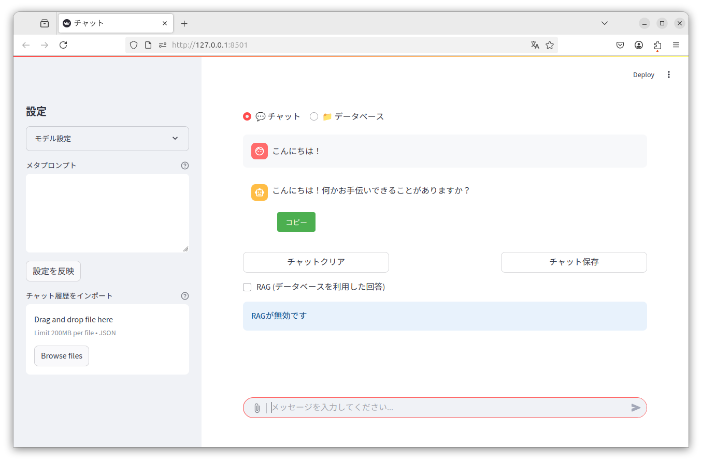

# Tiny Chat

## Installation

Tested with Python 3.10 or later

### Development Installation
```bash
pip install -r requirements.txt
```

### Package Installation
```bash
# Build the package
pip install build
python -m build

# Install the built package
pip install dist/*.whl
```

## Web Interface Usage

### Running from source (development)
```bash
streamlit run tiny_chat/main.py --server.address=127.0.0.1
```

### only database (development)
```bash
streamlit run tiny_chat/main.py --server.address=127.0.0.1 -- --database
```

### Running installed package
```bash
tiny-chat
```

### only database
```bash
tiny-chat --database
```



## MCP Usage
Claude Desktop example.
```json
{
  "mcpServers": {
    "tiny-chat": {
      "command": "/path/to/tiny_chat/.venv/bin/tiny-chat-mcp",
      "env": {
        "DB_CONFIG": "/path/to/tiny_chat/database_config.json"
      }
    }
  }
}
```

## OpenAI Chat API RAG Server Usage
```bash
tiny-chat-api
```
`model`: target search qdrant collection name (model change in conversation).
```bash
curl http://localhost:8080/v1/chat/completions   -H "Content-Type: application/json"   -d '{"model": "qdrant-collection-name", "messages": [{"role": "user", "content": "カレーライスの材料は？"}]}'
```
