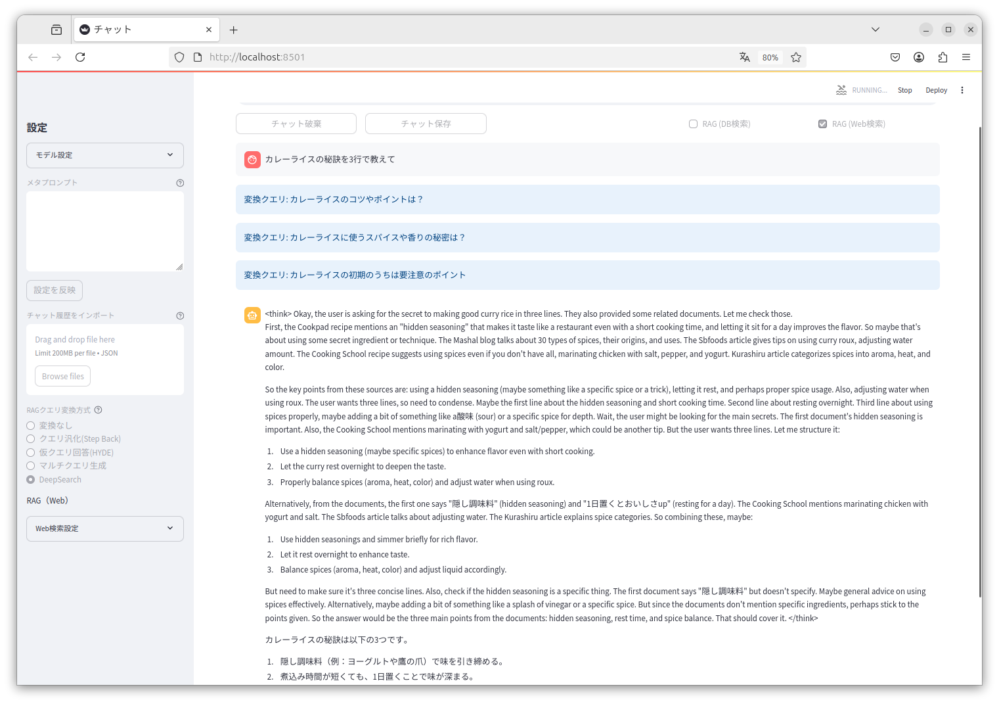

# Tiny Chat

## Installation

Tested with Python 3.10 or later

### Development Installation
```bash
pip install -r requirements.txt
```

### Package Installation
```bash
# Build the package
pip install build
python -m build

# Install the built package
pip install dist/*.whl
```

## Usage

### Running from source (development)
```bash
streamlit run tiny_chat/main.py --server.address=127.0.0.1
```

### only database (development)
```bash
streamlit run tiny_chat/main.py --server.address=127.0.0.1 -- --database
```


### Running installed package
```bash
tiny-chat
```

### only database
```bash
tiny-chat --database
```


